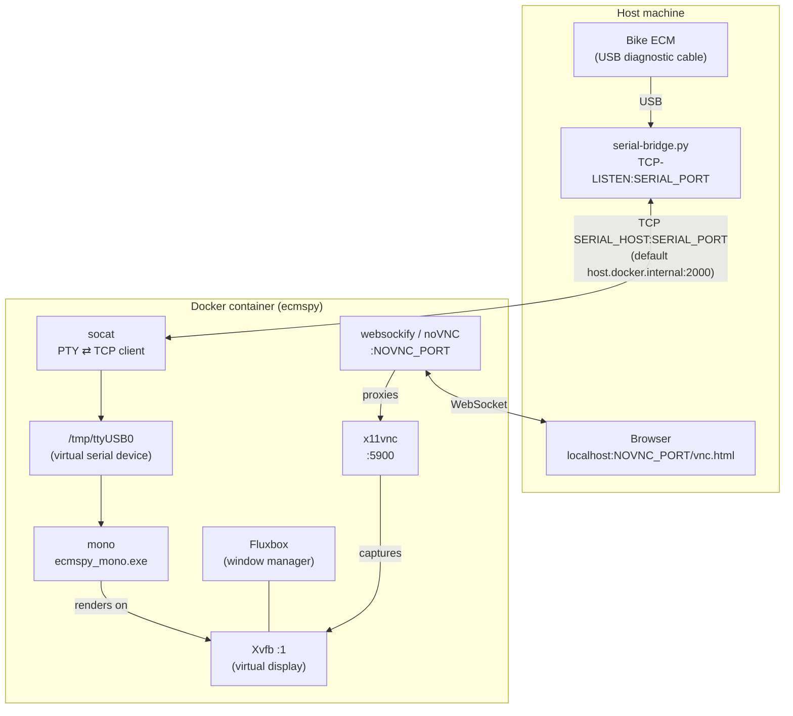

# ecmspy-container

New stuff in README

JFDI
1. Install Docker Desktop
2. Install Python programming language
3. Download this repository
4. Download ECM Spy & copy to the installer directory of this repository
5. Plug the ECM cable into the computer
6. Open a terminal window, change directory to where this repostitory is and type python -m pip install -r requirements.txt (this makes the USB cable available to the ECMSpy
7. Open a terminal window, change directory to where this repostitory is and type "docker compose up --build" - this builds ECMSpy inside a container - which should allow it to run on modern computers safely
8. Open a browser window / tab and navigate to http://localhost:6080/vnc.html

## What this is for:-

The ECMSpy application was written over 20 years ago for a Windows XP operating system.
Microsoft have long ceased supporting Windows XP, and so how can we run ECMSpy on modern hardware?
Ideally we would want to be platform agnostic for use. In other words it would be nice if we can run this on Windows 11 or Mac OSX or Linux.
One size fits all.

Fortunately a solution is available using docker technology, which encapsulates a set of software in a 'container'. This technology is used extensively in software development.
We also need a program that will run on all those operating systems in order to provide a unified interface for device handling - in this case a USB cable. I've selected the Python language as a)I'm using it day-to-day and b) it is available for Windows, OSX and Linux.

This repository of code provides:-
A Docker wrapper for running **EcmSpy for Mono** — a Windows/Mono diagnostic
tool for Buell motorcycle ECMs (engine control modules) — headlessly in a
container, with the GUI exposed in a browser over noVNC and the serial
connection to the bike bridged in over TCP.

This repo contains only the *packaging*: a Dockerfile, a compose file, and a
startup script. It does **not** contain EcmSpy itself — see
[Legal notice](#legal-notice) below.

## Quick start (no coding experience needed)

This section is for people who just want to plug in their bike and open
EcmSpy — it doesn't assume you know what Docker or a terminal is. If you get
stuck, the more technical [Setup](#setup) section below has the same steps
in short form.

**Before you start**, the computer with the bike's USB diagnostic cable
plugged into it needs to be sharing that cable over the network — step 3
below covers this the same way on Mac, Windows, and Linux. If someone else
already set this up for you (e.g. via `ser2net` on a separate box), you can
skip straight to step 4.

### 1. Install Docker Desktop

Docker Desktop is the one program that runs everything else for you.

1. Go to <https://www.docker.com/products/docker-desktop/> and download
   Docker Desktop for your computer (Mac or Windows).
2. Install it like any other application, then open it once. You should see
   a small whale icon appear — leave Docker Desktop running in the
   background whenever you use EcmSpy.

### 2. Download this project

1. Near the top of this page, click the green **Code** button, then
   **Download ZIP**.
2. Find the downloaded file (usually in your Downloads folder) and unzip it
   by double-clicking it. You'll end up with a folder named
   `ecmspy-mono-main` (GitHub names it after the repository, `ecmspy-mono`,
   and branch, `main` — the rest of this guide just calls it "the project
   folder"; feel free to rename it to whatever you like).

### 3. Bridge the bike's USB cable to the network

Skip this step if the cable is already being shared for you elsewhere. This
step is identical on Mac, Windows, and Linux.

1. Plug the bike's USB diagnostic cable into your computer.
2. Make sure you have Python 3 installed:
   - **Mac:** open Terminal and run `python3 --version`. If that fails,
     install [Homebrew](https://brew.sh) first, then run `brew install
     python`.
   - **Windows:** open PowerShell and run `python --version`. If that
     fails, run:

     ```powershell
     winget install --id Python.Python.3.14
     ```

     then close and reopen PowerShell so it picks up the new install.
3. In that same terminal, `cd` into the project folder (drag the folder
   from Finder/File Explorer into the terminal window to fill in the
   path), then install the one dependency this needs (first time only):

   - **Mac/Linux:** `python3 -m pip install -r requirements.txt`
   - **Windows:** `python -m pip install -r requirements.txt`

   (Using `python3 -m pip`/`python -m pip` here instead of a bare `pip`/
   `pip3` command sidesteps a common gotcha where `pip` isn't on your PATH
   even though Python itself is — this way always uses the pip that comes
   with the Python you just installed.)
4. Start the bridge:

   - **Mac/Linux:** `python3 serial-bridge.py`
   - **Windows:** `python serial-bridge.py`

   It finds the cable automatically:

   ```
   Found: /dev/cu.usbserial-AR0JV3ZE (FTDI)
   Bridging to TCP :2000 ... (Ctrl+C to stop)
   ```

   (On Windows this looks the same, just with a `COM` port name.) If it
   can't find exactly one adapter, it'll either tell you to plug the cable
   in or ask you to pick from a list.

   Leave this terminal window open and running the whole time you're using
   EcmSpy — closing it (or pressing Ctrl+C) disconnects the bike. This only
   binds to your own computer (`127.0.0.1`), which is all the container
   needs.

### 4. Add your EcmSpy installer

1. Get your own legally purchased copy of `EcmSpy_Mono_2.0-Setup.exe` (see
   [Legal notice](#legal-notice) — this project doesn't include it).
2. Move that file into the `installer` folder inside the project folder
   (already there, just empty), so the path looks like
   `installer/EcmSpy_Mono_2.0-Setup.exe`.

### 5. Start EcmSpy

1. Open a **new** terminal window (leave the `serial-bridge.py` one from
   step 3 running):
   - **Mac:** press **⌘ + Space**, type `Terminal`, press Return.
   - **Windows:** click Start, type `PowerShell`, press Enter.
2. Type `cd ` (with a trailing space), then drag the project folder from
   Finder/File Explorer into the terminal window and drop it — this fills
   in the folder's path for you. Press Return.
3. Type this and press Return:

   ```sh
   docker compose up --build
   ```
4. Wait. The first run downloads and builds everything, which can take
   several minutes — you'll see a lot of text scroll by, that's normal.
   It's ready when the scrolling slows down and you stop seeing new
   "building" messages.

### 6. Open EcmSpy in your browser

Go to:

```
http://localhost:6080/vnc.html
```

Click **Connect** if prompted. You should see the EcmSpy application
running, as if it were installed directly on your computer.

### Stopping and restarting

- To stop: go back to the terminal window running `docker compose` and
  press **Ctrl + C**. You can also stop the `serial-bridge.py` window
  (Ctrl + C there too) if you're done with the bike.
- To use it again later: redo steps 3 (`serial-bridge.py`) and 5 (`docker
  compose up --build`) — steps 1, 2, and 4 only need to be done once.

### If something goes wrong

- **"docker: command not found"** — Docker Desktop isn't installed, or
  isn't finished starting up. Open the Docker Desktop app and wait for the
  whale icon to say it's running.
- **The browser page won't load** — make sure the terminal from step 5 is
  still open and running; closing it stops EcmSpy.
- **EcmSpy can't see the bike** — make sure the `serial-bridge.py` window
  from step 3 is still open and running, and that the cable is plugged in.
  See [Configuration](#configuration) below for how to point this project
  at a different address, or ask whoever set up the cable bridge.
- **EcmSpy connects but the ECM never responds** — Factory Race ECMs use a
  different baud rate than stock ECMs. Stop `serial-bridge.py` and restart
  it with `--baud 19200` added (`python3 serial-bridge.py --baud 19200` on
  Mac/Linux, `python serial-bridge.py --baud 19200` on Windows).

## How it works



At build time, the image extracts EcmSpy from its official Inno Setup
installer using [`innoextract`](https://constexpr.org/innoextract/) — no
Wine required, and no EcmSpy binaries are ever committed to this repo.

At runtime, `start-ecmspy.sh`:
1. Starts a virtual X display (Xvfb) and a minimal window manager (Fluxbox).
2. Starts `x11vnc` and bridges it to a browser-accessible noVNC endpoint on
   port `6080`.
3. Starts a `socat` bridge that connects out to `SERIAL_HOST:SERIAL_PORT`
   over TCP and exposes it inside the container as a PTY, so EcmSpy can talk
   to it like a normal serial device.
4. Launches `ecmspy_mono.exe` under Mono.

## Legal notice

**EcmSpy is proprietary, third-party software and is not included in this
repository.** Its EULA (bundled with the installer) grants a personal,
non-commercial, single-computer license and explicitly prohibits copying,
publishing, or redistributing the software. This repo only ever operates on
a copy of the installer *you* provide locally and legally own — it is never
committed to git or baked into a published image.

You are responsible for obtaining your own legitimate copy of the "EcmSpy
for Mono" installer and complying with its license.

## Prerequisites

- Docker and Docker Compose
- Your own legally obtained `EcmSpy_Mono_2.0-Setup.exe` installer
- Python 3, to run the serial bridge (see below)
- A way to expose the diagnostic cable's serial port over TCP, reachable
  from the container. By default the container looks for this at
  `host.docker.internal:2000`.

## Setup

1. Place your installer at `installer/EcmSpy_Mono_2.0-Setup.exe` (this path
   is gitignored and stays local to your machine).
2. Bridge the cable — same on Mac, Windows, and Linux (use `python3` on
   Mac/Linux, `python` on Windows):

   ```sh
   python3 -m pip install -r requirements.txt
   python3 serial-bridge.py
   ```

   This auto-detects the USB-serial adapter and listens on TCP `:2000`
   (`127.0.0.1` only). Pass `--baud 19200` for Factory Race ECMs (stock
   ECMs use the default, 9600). Leave it running; use `--port`/`--tcp-port`
   to override auto-detection or the listening port, and see
   `python3 serial-bridge.py --help` for all options.

   Advanced/headless setups can use [`ser2net`](https://github.com/cminyard/ser2net)
   or a raw `socat TCP-LISTEN:2000 FILE:/dev/ttyUSB0,raw` instead, as long
   as something is listening on `SERIAL_HOST:SERIAL_PORT`.
3. Build and start the container:

   ```sh
   docker compose up --build
   ```
4. Open EcmSpy in your browser:

   ```
   http://localhost:6080/vnc.html
   ```

## Configuration

Set via environment variables in `compose.yaml`:

| Variable      | Default                 | Description                                   |
|---------------|--------------------------|------------------------------------------------|
| `SERIAL_HOST` | `host.docker.internal`  | Host/IP of the TCP-exposed serial connection   |
| `SERIAL_PORT` | `2000`                  | Port of the TCP-exposed serial connection      |
| `NOVNC_PORT`  | `6080`                  | Port to expose the noVNC web UI on             |

Volumes:

- `./data` → `/home/ecmspy/data` — mount point where the bridged serial
  device is linked (`data/ttyUSB0`)
- `ecmspy-logs` (named volume) → `/home/ecmspy/ecmspy/applog` — EcmSpy's
  application logs, persisted across container restarts

## Development / testing

`Dockerfile.test` builds a minimal, non-VNC image (headless Xvfb only) for
smoke-testing that EcmSpy launches correctly under Mono:

```sh
docker build -f Dockerfile.test -t ecmspy-test .
docker run --rm ecmspy-test
```

## License

The packaging in this repository (`Dockerfile`, `Dockerfile.test`,
`compose.yaml`, `start-ecmspy.sh`) is licensed under the [MIT
License](LICENSE). EcmSpy itself is proprietary software under its own
license and is not covered by this repo's license.
